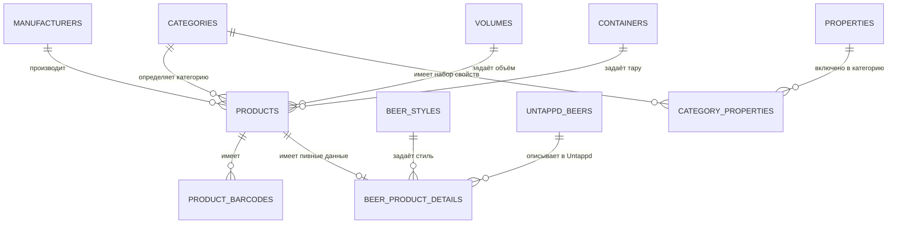

# Структура базы данных каталога товаров

## 1. Постановка задачи

Необходимо спроектировать структуру MySQL-базы данных для каталога магазина на Laravel 12. Основной товар магазина — крафтовое пиво, поэтому схема должна обеспечивать быстрые фильтры по следующим полям:

- категория;
- пивоварня (производитель);
- ABV;
- IBU;
- Plato;
- EBC;
- стиль пива;
- UntappdRef;
- цена.

Для товара также нужны нормализованные значения объёма и тары. Они будут определяться будущим парсером из исходного поля `Упаковка` и должны храниться в отдельных справочниках. Стиль пива также должен быть отдельным справочником.

Значение `UntappdRef` из каталога соответствует внешнему идентификатору `untappd_beers.beer_id`. Товар связывается с записью Untappd через внутренний первичный ключ `untappd_beers.id`.

Нужен отдельный механизм, который определяет допустимый, обязательный и фильтруемый набор свойств для каждой категории. Он используется только как метаописание: фактические значения частых фильтров хранятся в типизированных колонках, а не в JSON или EAV.

В рамках текущей задачи описывается только структура базы данных. Миграции, модели, парсер, импорт, команды и пользовательский интерфейс не рассматриваются.

## 2. Результаты анализа исходного каталога

Источник: `data/ExportCatalog.csv`, кодировка Windows-1251, разделитель `;`.

- 1 290 строк исходных данных.
- 982 уникальных товара по `id_объекта` и `КодТовара`.
- 1 260 уникальных непустых штрихкодов; один товар может иметь до четырёх штрихкодов.
- 52 производителя и 204 исходных значения стиля.
- Пивные характеристики заполнены не для всех товаров: ABV отсутствует у 89 строк, IBU — у 702, Plato — у 1 003, EBC — у 1 164.
- `UntappdRef` отсутствует у 87 строк; также встречается некорректное значение `-`.
- В поле `Упаковка` найдено 22 варианта записи; 8 строк не имеют значения.
- В каталоге присутствуют непивные и сопутствующие товары.

Из этого следуют основные решения:

1. Строка CSV не равна товару: дубликаты товара сворачиваются по `id_объекта`, а штрихкоды хранятся отдельно.
2. Пивные поля вынесены в отношение один-к-одному `beer_product_details`, чтобы не заполнять таблицу `products` nullable-колонками, неприменимыми к сувенирам, соусам и другим товарам.
3. ABV, IBU, Plato, EBC и цена хранятся числовыми значениями, чтобы фильтрация по диапазону использовала B-tree индексы.
4. Объём хранится в целых миллилитрах. Это исключает ошибки сравнения дробных значений `0.33`, `0.45`, `20.0`.

## 3. Схема связей

## 4. Таблицы

### 4.1. `categories`

Плоский справочник категорий магазина. Иерархия исходного поля CSV не используется как структура каталога: категорию будет определять парсер по совокупности признаков.

| Колонка | Тип MySQL | Ограничения и назначение |
|---|---|---|
| `id` | `BIGINT UNSIGNED` | PK, auto increment |
| `code` | `VARCHAR(64)` | NOT NULL, стабильный программный код |
| `name` | `VARCHAR(255)` | NOT NULL, отображаемое название |
| `slug` | `VARCHAR(255)` | NOT NULL, URL-идентификатор |
| `is_active` | `BOOLEAN` | NOT NULL, default `true` |
| `sort_order` | `SMALLINT UNSIGNED` | NOT NULL, default `0` |
| `created_at` | `TIMESTAMP` | NULL |
| `updated_at` | `TIMESTAMP` | NULL |

Ограничения и индексы:

- `PRIMARY KEY (id)`;
- `UNIQUE (code)`;
- `UNIQUE (slug)`;
- `INDEX (is_active, sort_order)`.

Начальные значения:

| `code` | `name` |
|---|---|
| `merchandise` | Атрибутика |
| `beer_related` | К пиву |
| `mead` | Мёд |
| `beer` | Пиво |
| `cider` | Сидр |
| `sauce` | Соус |
| `souvenirs` | Сувениры |
| `unclassified` | не определена |
| `soft_drinks` | Безалкогольные напитки |

Категория `unclassified` обязательна и используется, если парсер не смог уверенно классифицировать товар.

### 4.2. `manufacturers`

Справочник производителей и пивоварен.

| Колонка | Тип MySQL | Ограничения и назначение |
|---|---|---|
| `id` | `BIGINT UNSIGNED` | PK, auto increment |
| `name` | `VARCHAR(255)` | NOT NULL |
| `normalized_name` | `VARCHAR(255)` | NOT NULL, имя для дедупликации |
| `slug` | `VARCHAR(255)` | NOT NULL |
| `is_active` | `BOOLEAN` | NOT NULL, default `true` |
| `created_at` | `TIMESTAMP` | NULL |
| `updated_at` | `TIMESTAMP` | NULL |

Ограничения и индексы:

- `PRIMARY KEY (id)`;
- `UNIQUE (normalized_name)`;
- `UNIQUE (slug)`.

Удаление используемого производителя запрещено (`ON DELETE RESTRICT`). Неактуальные записи деактивируются через `is_active`.

### 4.3. `volumes`

Справочник объёмов единицы товара.

| Колонка | Тип MySQL | Ограничения и назначение |
|---|---|---|
| `id` | `BIGINT UNSIGNED` | PK, auto increment |
| `milliliters` | `INT UNSIGNED` | NOT NULL, объём в миллилитрах |
| `label` | `VARCHAR(32)` | NOT NULL, например `0,45 л` или `20 л` |
| `created_at` | `TIMESTAMP` | NULL |
| `updated_at` | `TIMESTAMP` | NULL |

Ограничения и индексы:

- `PRIMARY KEY (id)`;
- `UNIQUE (milliliters)`.

Примеры: 450 мл хранится как `450`, 20 л — как `20000`.

### 4.4. `containers`

Справочник типов тары.

| Колонка | Тип MySQL | Ограничения и назначение |
|---|---|---|
| `id` | `BIGINT UNSIGNED` | PK, auto increment |
| `code` | `VARCHAR(64)` | NOT NULL, программный код |
| `name` | `VARCHAR(255)` | NOT NULL, отображаемое название |
| `is_active` | `BOOLEAN` | NOT NULL, default `true` |
| `created_at` | `TIMESTAMP` | NULL |
| `updated_at` | `TIMESTAMP` | NULL |

Ограничения и индексы:

- `PRIMARY KEY (id)`;
- `UNIQUE (code)`.

Начальные коды: `can` — алюминиевая банка, `glass_bottle` — стеклянная бутылка, `pet_keg` — ПЭТ-кег. Если тара не определена или неприменима, `products.container_id` остаётся `NULL`.

### 4.5. `beer_styles`

Нормализованный справочник стилей пива и других напитков, для которых применим стиль.

| Колонка | Тип MySQL | Ограничения и назначение |
|---|---|---|
| `id` | `BIGINT UNSIGNED` | PK, auto increment |
| `name` | `VARCHAR(255)` | NOT NULL |
| `normalized_name` | `VARCHAR(255)` | NOT NULL, значение для дедупликации |
| `slug` | `VARCHAR(255)` | NOT NULL |
| `is_active` | `BOOLEAN` | NOT NULL, default `true` |
| `created_at` | `TIMESTAMP` | NULL |
| `updated_at` | `TIMESTAMP` | NULL |

Ограничения и индексы:

- `PRIMARY KEY (id)`;
- `UNIQUE (normalized_name)`;
- `UNIQUE (slug)`.

Нормализованное имя необходимо из-за различий регистра, пробелов и визуально похожих латинских и кириллических символов в исходном каталоге.

### 4.6. `products`

Основная таблица товаров. Одна запись соответствует уникальному `id_объекта`, а не строке CSV.

| Колонка | Тип MySQL | Ограничения и назначение |
|---|---|---|
| `id` | `BIGINT UNSIGNED` | PK, auto increment |
| `source_uuid` | `CHAR(36)` | NOT NULL, исходное `id_объекта` |
| `external_code` | `VARCHAR(64)` | NOT NULL, исходный `КодТовара` |
| `article` | `VARCHAR(255)` | NULL, исходный `Артикул` |
| `name` | `VARCHAR(512)` | NOT NULL |
| `description` | `TEXT` | NULL |
| `category_id` | `BIGINT UNSIGNED` | NOT NULL, FK на `categories.id` |
| `manufacturer_id` | `BIGINT UNSIGNED` | NULL, FK на `manufacturers.id` |
| `volume_id` | `BIGINT UNSIGNED` | NULL, FK на `volumes.id` |
| `container_id` | `BIGINT UNSIGNED` | NULL, FK на `containers.id` |
| `price` | `DECIMAL(12,2)` | NOT NULL, default `0.00` |
| `stock_quantity` | `INT UNSIGNED` | NOT NULL, default `0` |
| `in_stock` | `BOOLEAN` | NOT NULL, default `false`, признак доступности товара для заказа |
| `package_units` | `SMALLINT UNSIGNED` | NULL, количество единиц в коробке/упаковке |
| `packaging_raw` | `VARCHAR(255)` | NULL, исходное поле `Упаковка` |
| `source_category_path` | `TEXT` | NULL, исходное поле `Категория` без разбора |
| `shelf_life_days` | `SMALLINT UNSIGNED` | NULL, срок годности в днях |
| `brand` | `VARCHAR(255)` | NULL, исходная `Марка` |
| `sales_rating` | `VARCHAR(64)` | NULL, исходный `РейтингПродаж` |
| `is_active` | `BOOLEAN` | NOT NULL, default `true` |
| `created_at` | `TIMESTAMP` | NULL |
| `updated_at` | `TIMESTAMP` | NULL |

Ограничения и правила удаления:

- `PRIMARY KEY (id)`;
- `UNIQUE (source_uuid)`;
- `UNIQUE (external_code)`;
- `category_id` — `ON UPDATE CASCADE`, `ON DELETE RESTRICT`;
- `manufacturer_id`, `volume_id`, `container_id` — `ON UPDATE CASCADE`, `ON DELETE RESTRICT`;
- справочные значения, связанные с товарами, деактивируются, а не удаляются.

Индексы фильтрации:

- `INDEX products_category_manufacturer_price_idx (category_id, manufacturer_id, price)`;
- `INDEX products_category_price_idx (category_id, price)`;
- `INDEX products_manufacturer_price_idx (manufacturer_id, price)`;
- `INDEX products_price_idx (price)`;
- `INDEX products_volume_container_idx (volume_id, container_id)`;
- `INDEX products_container_idx (container_id)`;
- `INDEX products_active_stock_id_idx (is_active, in_stock, id)`.

Несколько индексов нужны из-за правила левого префикса MySQL: индекс `(category_id, manufacturer_id, price)` не обеспечивает эффективный поиск только по производителю или только по цене.

### 4.7. `product_barcodes`

Отдельная таблица штрихкодов устраняет дублирование товара при наличии нескольких кодов.

| Колонка | Тип MySQL | Ограничения и назначение |
|---|---|---|
| `id` | `BIGINT UNSIGNED` | PK, auto increment |
| `product_id` | `BIGINT UNSIGNED` | NOT NULL, FK на `products.id` |
| `barcode` | `VARCHAR(32)` | NOT NULL; текстовый тип сохраняет ведущие нули |
| `created_at` | `TIMESTAMP` | NULL |
| `updated_at` | `TIMESTAMP` | NULL |

Ограничения и индексы:

- `PRIMARY KEY (id)`;
- `UNIQUE (barcode)`;
- `INDEX (product_id)`;
- `product_id` — `ON UPDATE CASCADE`, `ON DELETE CASCADE`.

Кардинальность: один товар имеет от нуля до нескольких штрихкодов; один штрихкод принадлежит только одному товару.

### 4.8. `untappd_beers`

Справочник данных Untappd. Значение CSV `UntappdRef` записывается в `beer_id`, но внешние ключи используют внутренний `id`.

| Колонка | Тип MySQL | Ограничения и назначение |
|---|---|---|
| `id` | `BIGINT UNSIGNED` | PK, auto increment |
| `beer_id` | `BIGINT UNSIGNED` | NOT NULL, внешний идентификатор Untappd |
| `name` | `VARCHAR(255)` | NULL |
| `brewery` | `VARCHAR(255)` | NULL |
| `style` | `VARCHAR(255)` | NULL, исходное значение Untappd |
| `rating_count` | `INT UNSIGNED` | NOT NULL, default `0` |
| `rating_score` | `DECIMAL(3,2)` | NULL |
| `label` | `VARCHAR(255)` | NULL |
| `url` | `VARCHAR(2048)` | NULL |
| `synced_at` | `TIMESTAMP` | NULL |
| `created_at` | `TIMESTAMP` | NULL |
| `updated_at` | `TIMESTAMP` | NULL |

Ограничения и индексы:

- `PRIMARY KEY (id)`;
- `UNIQUE (beer_id)`.

Поля данных Untappd допускают `NULL`, чтобы сначала зарегистрировать известный `beer_id`, а остальные сведения заполнить позднее. Пустой или некорректный `UntappdRef` не создаёт запись.

### 4.9. `beer_product_details`

Пивные характеристики товара. Таблица имеет связь один-к-одному с `products`, но одна запись Untappd или один стиль могут относиться к нескольким товарным позициям, например к разной таре одного напитка.

| Колонка | Тип MySQL | Ограничения и назначение |
|---|---|---|
| `product_id` | `BIGINT UNSIGNED` | PK и FK на `products.id` |
| `beer_style_id` | `BIGINT UNSIGNED` | NULL, FK на `beer_styles.id` |
| `untappd_beer_id` | `BIGINT UNSIGNED` | NULL, FK на `untappd_beers.id` |
| `abv` | `DECIMAL(5,2)` | NULL, процент алкоголя |
| `ibu` | `DECIMAL(6,2)` | NULL, горечь |
| `plato` | `DECIMAL(5,2)` | NULL, начальная плотность |
| `ebc` | `DECIMAL(6,2)` | NULL, цветность |
| `created_at` | `TIMESTAMP` | NULL |
| `updated_at` | `TIMESTAMP` | NULL |

Ограничения и правила удаления:

- `PRIMARY KEY (product_id)` гарантирует не более одной записи характеристик на товар;
- `product_id` — `ON UPDATE CASCADE`, `ON DELETE CASCADE`;
- `beer_style_id` — `ON UPDATE CASCADE`, `ON DELETE RESTRICT`;
- `untappd_beer_id` — `ON UPDATE CASCADE`, `ON DELETE SET NULL`.

Индексы фильтрации:

- `INDEX beer_details_style_abv_idx (beer_style_id, abv, product_id)`;
- `INDEX beer_details_abv_idx (abv, product_id)`;
- `INDEX beer_details_ibu_idx (ibu, product_id)`;
- `INDEX beer_details_plato_idx (plato, product_id)`;
- `INDEX beer_details_ebc_idx (ebc, product_id)`;
- `INDEX beer_details_untappd_idx (untappd_beer_id, product_id)`.

Один общий индекс `(abv, ibu, plato, ebc)` не создаётся: при нескольких независимых диапазонах MySQL не сможет эффективно использовать все его части.

### 4.10. `properties`

Справочник доступных свойств. Таблица содержит только описание поля и место хранения, но не значения товаров.

| Колонка | Тип MySQL | Ограничения и назначение |
|---|---|---|
| `id` | `BIGINT UNSIGNED` | PK, auto increment |
| `code` | `VARCHAR(64)` | NOT NULL, стабильный код свойства |
| `name` | `VARCHAR(255)` | NOT NULL |
| `data_type` | `VARCHAR(32)` | NOT NULL: `decimal`, `integer`, `string` или `reference` |
| `unit` | `VARCHAR(32)` | NULL, например `%`, `IBU`, `°P`, `EBC`, `мл` |
| `storage_table` | `VARCHAR(64)` | NOT NULL, физическая таблица значения |
| `storage_column` | `VARCHAR(64)` | NOT NULL, физическая колонка значения |
| `created_at` | `TIMESTAMP` | NULL |
| `updated_at` | `TIMESTAMP` | NULL |

Ограничения и индексы:

- `PRIMARY KEY (id)`;
- `UNIQUE (code)`;
- `UNIQUE (storage_table, storage_column)`.

Примеры: `abv` ссылается на `beer_product_details.abv`, `volume` — на `products.volume_id`. Эти ссылки являются метаданными приложения, а не внешними ключами MySQL.

### 4.11. `category_properties`

Определяет набор свойств, применимый к конкретной категории.

| Колонка | Тип MySQL | Ограничения и назначение |
|---|---|---|
| `category_id` | `BIGINT UNSIGNED` | NOT NULL, FK на `categories.id` |
| `property_id` | `BIGINT UNSIGNED` | NOT NULL, FK на `properties.id` |
| `is_required` | `BOOLEAN` | NOT NULL, default `false` |
| `is_filterable` | `BOOLEAN` | NOT NULL, default `false` |
| `is_visible` | `BOOLEAN` | NOT NULL, default `true` |
| `sort_order` | `SMALLINT UNSIGNED` | NOT NULL, default `0` |

Ограничения и индексы:

- `PRIMARY KEY (category_id, property_id)`;
- `INDEX (property_id)`;
- оба внешних ключа используют `ON UPDATE CASCADE`, `ON DELETE CASCADE`.

Предлагаемый начальный набор:

- `Пиво`: объём, тара, ABV, IBU, Plato, EBC, стиль пива, Untappd;
- `Мёд` и `Сидр`: объём, тара, ABV, стиль, Untappd;
- `Безалкогольные напитки`: объём и тара;
- `Соус`: объём и тара;
- остальные категории: только применимые справочные свойства, без пивных характеристик.

Категория, производитель и цена являются общими полями товара и не требуют включения в `category_properties`.

## 5. Соответствие фильтров структуре

| Фильтр | Источник | Тип условия | Используемый индекс |
|---|---|---|---|
| Категория | `products.category_id` | точное равенство | `products_category_price_idx` или составной индекс с производителем |
| Пивоварня | `products.manufacturer_id` | точное равенство | `products_manufacturer_price_idx` |
| Цена | `products.price` | диапазон | `products_price_idx` и составные индексы |
| ABV | `beer_product_details.abv` | диапазон | `beer_details_abv_idx` |
| IBU | `beer_product_details.ibu` | диапазон | `beer_details_ibu_idx` |
| Plato | `beer_product_details.plato` | диапазон | `beer_details_plato_idx` |
| EBC | `beer_product_details.ebc` | диапазон | `beer_details_ebc_idx` |
| Стиль пива | `beer_product_details.beer_style_id` | точное равенство | `beer_details_style_abv_idx` |
| UntappdRef | `untappd_beers.beer_id` через `beer_product_details.untappd_beer_id` | точное равенство | unique `untappd_beers.beer_id` и `beer_details_untappd_idx` |
| Объём | `products.volume_id` | точное равенство | `products_volume_container_idx` |
| Тара | `products.container_id` | точное равенство | `products_volume_container_idx` при совместном фильтре; `products_container_idx` для отдельного фильтра |

## 6. Обоснование архитектуры

### Типизированные колонки вместо JSON/EAV

ABV, IBU, Plato и EBC участвуют в диапазонных фильтрах. Числовые колонки сохраняют корректную сортировку, позволяют задать точность и эффективно используют B-tree индексы. JSON и универсальная таблица значений усложнили бы запросы, потребовали приведения типов и ухудшили предсказуемость планов MySQL.

`properties` и `category_properties` решают только задачу описания формы категории: какие поля допустимы, обязательны, видимы и доступны как фильтр. Значения при этом не дублируются.

### Отдельная таблица пивных характеристик

`beer_product_details` отделяет пивные данные от общей сущности товара. Непивные товары не содержат неприменимых nullable-полей, а фильтрация пива остаётся реляционной и индексируемой.

### Отдельные справочники объёма и тары

Справочники предотвращают варианты одного значения вроде `0,45л`, `0.45 л` и `450 мл`. Товар хранит внешние ключи на нормализованные значения, одновременно сохраняя исходную строку `packaging_raw` для аудита.

### Внутренний и внешний идентификаторы Untappd

`untappd_beers.beer_id` является внешним стабильным идентификатором API Untappd и имеет уникальный индекс. Все внутренние связи используют `untappd_beers.id`, поэтому внешний формат не распространяется на внешние ключи приложения.

### Удаление справочных данных

Категории, производители, объёмы, тара и стили не удаляются, пока используются товарами; вместо этого применяется `is_active`. Зависимые данные без самостоятельного смысла — штрихкоды, пивные характеристики и назначения свойств — удаляются каскадно вместе с владельцем.

## 7. Итоговые гарантии схемы

- Каждый уникальный исходный товар хранится один раз.
- Один товар может иметь несколько штрихкодов без дублирования остальных данных.
- Все заявленные фильтры связаны с типизированными колонками и индексами.
- Непивные товары не получают набор пивных колонок в `products`.
- Объём, тара, производитель и стиль нормализованы отдельными справочниками.
- Категория всегда задана; для неопределённых товаров используется `unclassified`.
- Пустой `UntappdRef` допустим, действительный внешний идентификатор уникален.
- Набор свойств категории задаётся отдельно и не дублирует значения товаров.
